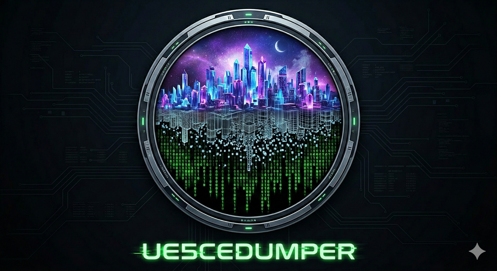

# UE5CEDumper — a UE Dumper for Unreal Engine 4 / 5 and Cheat Engine
  

UE5CEDumper is a UE Dumper (an Unreal Engine dumper) for Windows x64 games built on Unreal Engine 4.11 to 5.8. A DLL loaded into the game finds the engine's global tables (GObjects, GNames, GWorld) and reads its reflection data. A standalone UI connects to that DLL to browse objects and classes with their live property values, to search by name or by value, and to export what it finds.

It is made to be used with Cheat Engine. It exports pointer-chain records, Structure Dissect definitions and Auto Assembler scripts, and with the optional AOBMaker plugin it sends them straight into a running Cheat Engine. It also exports SDK headers, USMAP files and a full metadata dump (`.jsonl`) for offline use.

> ### Scope of use
>
> **Windows x64, single-player / offline only.** This is an inspection and debugging tool for games
> you legally own, on your own machine. Do not use it in multiplayer, competitive or online modes —
> besides being unfair, that is where anti-cheat, account bans and legal exposure actually live.
> UE5CEDumper reads the memory of a running process; it does not redistribute any game code, assets
> or keys, and it does not touch pak/IoStore container encryption.

---

## Sample screenshots
  
  

## Highlights

A quick look at what you can *do* with it — the full table-maker feature list is in **[docs/Features.md](docs/Features.md)**:

- **Zero-setup global pointers** — most UE dumpers make you find GObjects / GNames / GWorld yourself first. UE5CEDumper ships a built-in database of 150+ AOB signatures (plus symbol-export lookups) for **GObjects, GNames, GWorld, GEngine and SparseDelegates**, verified against a corpus of UE 4.11 – 5.8 binaries, so it **auto-detects the core pointers of most UE games** on its own. When every pattern misses, it falls back instead of giving up: GObjects to a data-section scan, GNames to string-reference and pointer scans, and **GWorld to a UWorld-instance scan in GObjects, then to `GEngine → GameViewport → World`**.
- **Live memory inspection** — browse objects, find every instance of a class, drill into struct / class layouts with live values.
- **Value Search** — CE-style First Scan / Next Scan over every UE property (numbers, strings, vectors, arrays / maps / sets), so you cheat without knowing offsets. A **Group** mode finds the object holding *several* values at once (e.g. `Str + Def + Dex + Int`), and an opt-in **Deep** mode reaches into nested containers.
- **Teleport** — 3 save/recall markers (BugItGo-style), **teleport-to-cursor** for top-down / 2.5D games, custom global hotkeys, and a read-only **camera POV** readout.¹
- **Player tuning** — **Super Jump / Move Speed / Gravity** sliders, **God Mode**, and **Time Dilation** (global or player-only slow-mo / freeze / fast-forward) — all reflection-forced and held against per-tick overwrites, so they survive respawns. Hotkeys or CE on/off records.
- **Debug Camera** — force the free-fly debug camera on/off, even on Shipping builds that normally get stuck.
- **Console** — discover and one-click invoke the `fly` / `god` / `ghost` / game-specific exec commands many games leave in.
- **Live function profiler** — record *one* in-game action (open a shop, dash) and see exactly which UFunctions fired, ranked with baseline-diff + noise filters. Behaviour-first, when name search can't.
- **One-click CE export** — pointer-chain XML, Structure Dissect (CSX), SDK headers, AA scripts, multi-row `.CT` batches.
- **Dump Explorer** — browse an exported "Dump All" `.jsonl` offline, one keyword search across classes, structs, enums, their members and function parameters. **Compare…** diffs it against another dump of the same game and writes an HTML report of what a patch moved, retyped, added or removed.
- **No Cheat Engine needed to inject** — a `version.dll` **proxy DLL**, in-UI **Inject into running game…**, or the **`inject-ue.ps1`** CLI (auto-elevates for admin games). Proxy Deploy **suggests the right proxy per game**.

> ¹ A few heavily-stripped Shipping builds (e.g. Titan Quest II) can't do *cursor* teleport — they remove the standard cursor / viewport / line-trace APIs and use a custom virtual cursor. See [docs/teleport-spec.md](docs/teleport-spec.md).

## Tested Version Matrix

Games grouped by UE version range. Per-game detail — layout quirks, proxy notes, verification — lives in **[docs/test-games.md](docs/test-games.md)**. *Satisfactory* appears in two rows because its UE version moved across game versions.

| UE Version | GObjects | GNames | DynOff | Verified Games |
|---|:---:|:---:|:---:|---|
| **4.11 – 4.14** | ✅ | ✅ | ✅ | NEKOPALIVE |
| **4.15 – 4.17** | ✅ | ✅ | ✅ | Extinction |
| **4.18 – 4.20** | ✅ | ✅ | ✅ | FF7 Remake Intergrade, The Occupation, DQ XI S, Octopath Traveler |
| **4.21 – 4.24** | ✅ | ✅ | ✅ | Star Wars Jedi, IDOLM@STER STARLIT SEASON |
| **4.25 – 4.27** | ✅ | ✅ | ✅ | FF7 Rebirth, DQ I&II / III HD-2D Remake, Stellar Blade (劍星), Tower of Mask, Hogwarts Legacy, Romancing SaGa 2 RotS, Ghostwire: Tokyo, TimeSplitters Rewind, The Artisan of Glimmith, Barn Finders, MOBILE SUIT GUNDAM SEED Battle Destiny Remastered, Persona 3 Reload |
| **5.0 – 5.2** | ✅ | ✅ | ✅ | Squirrel With A Gun, Caravan Sandwitch, Meltopia, Retro Rewind Demo |
| **5.3 – 5.4** | ✅ | ✅ | ✅ | Satisfactory (v1.1.3.1), Colossal, Avowed, Echoes of Aincrad Demo, The Adventures of Elliot, MindsEye, DragonSword Awakening, The Outer Worlds 2 |
| **5.5 – 5.7** | ✅ | ✅ | ✅ | Titan Quest II, EverSpace 2, Lushfoil Photography Sim, Manor Lords, Cat Island Petrichor Demo, Way of the Hunter 2 Demo, COMBAT PILOT: CARRIER QUALIFICATION Demo, Solarpunk, Pionero Capital Demo, Satisfactory (v1.2.3.1), Star Trek Voyager – Across the Unknown |
| **5.8** | ✅ | ✅ | ✅ | Ski-E-O Demo, Unknown Operations: The Habitus Demo |

*UE 4.11 is the supported floor; 4.10 and older are reported as unsupported.*

---

## Getting started

Load the DLL into the game in one of three ways. Use one at a time, and load a save first so that the game's objects exist.

### Option A: Cheat Engine

1. Attach Cheat Engine to the game and open `UE5CEDumper.CT`.
2. Enable `init <== enable after process attached`, then `Inject DLL + Start Pipe Server`.
3. Start **UE5DumpUI.exe** and click **Connect**.

### Option B: Proxy DLL (recommended, no Cheat Engine)

1. In **UE5DumpUI.exe**, open the **Proxy Deploy** tab and deploy to the game. It suggests the proxy DLL the game needs and copies it next to the game's `.exe`.
2. Start the game and load a save.
3. Click **Connect**, then **Start Scan**.

### Option C: Inject into a running game (no Cheat Engine, no restart)

- **From the UI**: Proxy Deploy tab → **Inject into running game…** → pick the game → **Inject**.
- **From the command line**: `.\inject-ue.ps1` (`-List` shows the detected games, `-ProcessId <pid>` picks one), then start **UE5DumpUI.exe** and click **Connect**.

After that: browse the object tree, find a class or an instance, and export what you need. Step-by-step guides are in the [Wiki](https://github.com/bbfox0703/UE5CEDumper/wiki), and every feature is listed in [docs/Features.md](docs/Features.md).

> **x64 games only.** Like any injection, this may be flagged by anti-virus and is blocked by kernel anti-cheat (EAC / BattlEye). See *Scope of use* at the top.

### Optional: AOBMaker

[AOBMaker](https://github.com/bbfox0703/AOBMaker-Release) and its Cheat Engine plugin let UE5CEDumper send what it finds straight into the open CE table: memory records, AA scripts, symbols for GObjects / GNames / GWorld, and a Live Walker structure into Structure Dissect. It also moves CE's memory view and disassembler to an address. Everything else works without it.

## Requirements

- Windows 10/11 x64
- An Unreal Engine 4 or 5 game (x64)
- Cheat Engine, only for Option A (last tested with Cheat Engine 7.7)

To build from source: `bootstrap.cmd` shows what the machine needs, then `build.cmd`. Details are in [docs/toolchain.md](docs/toolchain.md).

---

## Notes

* **Data outside `UObject`s**: some games (*FF7 Rebirth*, for one) keep important values such as HP in their own structures. The Live Walker can help you look at those regions, but it cannot find them for you.
* **When *Start from GWorld* does not work** on a game that is not in the table above, use **Object Tree** or **Instance Finder** as the way in.
* **Games started through the EA app** load no proxy DLL. Use Option A or C once the game is running.
* **Games that pause in the background** make anything that calls into the game time out. The UI shows a "game thread stalled" banner when that happens, and the experimental **Keep Foreground** toggle works around it.
* **Large arrays, maps and sets** are read up to the **Array Limit** slider in the Live Walker.

Per-game notes are in [docs/test-games.md](docs/test-games.md).

---

## Reporting a problem

Open an [issue](https://github.com/bbfox0703/UE5CEDumper/issues) with the game's name, what you did and what happened, and attach the log folders `%LOCALAPPDATA%\UE5CEDumper\Logs\<game exe name>` and `%LOCALAPPDATA%\UE5CEDumper\Logs\UE5DumpUI`. The game's `scan` log is the most useful one.

---

## References & Credits

| Project | Use |
|---|---|
| [Encryqed/Dumper-7](https://github.com/Encryqed/Dumper-7) | Dynamic offset detection patterns, FField/FProperty probing strategy |
| [UE4SS-RE/RE-UE4SS](https://github.com/UE4SS-RE/RE-UE4SS) | UE5 runtime reflection, alternative angle |
| [Spuckwaffel/UEDumper](https://github.com/Spuckwaffel/UEDumper) | Live editor UI architecture reference |
| [trumank/patternsleuth](https://github.com/trumank/patternsleuth) | Additional AOB patterns for GObjects/GNames |
| [Do0ks/GSpots](https://github.com/Do0ks/GSpots) | Additional AOB patterns for GObjects/GNames |
| [nlohmann/json](https://github.com/nlohmann/json) | Header-only JSON library used in DLL |
| [cheat-engine/cheat-engine](https://github.com/cheat-engine/cheat-engine) | CE Lua scripting API reference |
| **AOBMaker (private)** | AOB pattern generation tooling, AA script generation and fast CE-Goto (not a must) |
| UE4 Dumper.CT | Cake-san's cheat table — additional UE4 AOB patterns (the CT series in `Himmel.h`) |

**Testing** — thanks to **Marc@OCT** and **SeryogaSK@OCT** ([OCT](https://opencheattables.com/)) for helping test this tool.

---

## Built with Claude Code

This project is developed with the assistance of [Claude Code](https://claude.ai/code) by Anthropic. The C++ DLL, C# Avalonia UI, build scripts, and documentation are collaboratively authored by the developer and Claude Code. The repo also carries a local-LLM helper that Claude Code sessions in any repo can share: see [tools/llm/README.md](tools/llm/README.md).

---

**License**: [MIT](LICENSE) © 2026 bbfox0703
