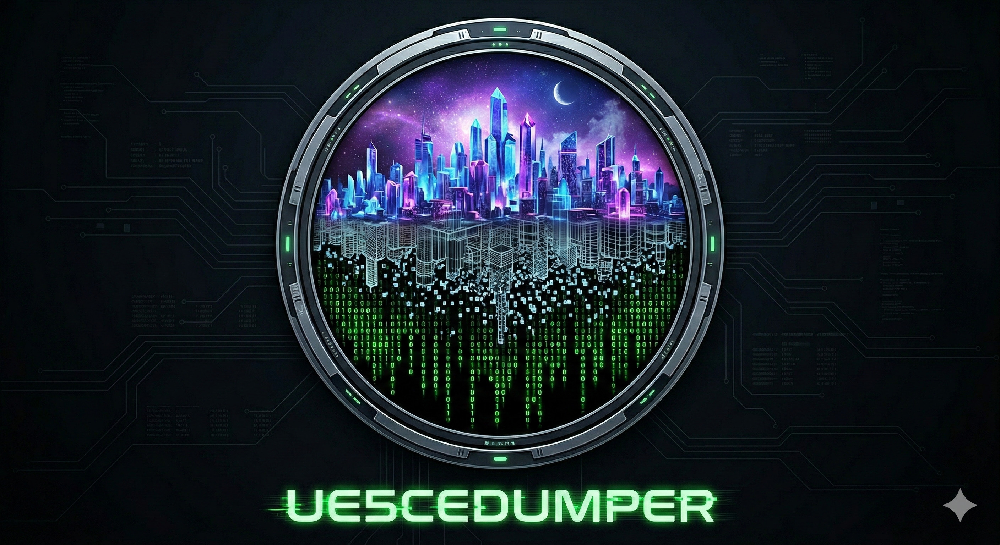

# UE5CEDumper
  

**The Live Bridge between Unreal Engine Runtime and Cheat Engine.**

UE5CEDumper is a interactive inspector toolchain. It provides a **live window** into the game's memory, allowing you to browse objects, find instances, and export CE-ready structures in real-time.

> It's built for the *active* table maker. It bridges the gap between seeing an offset and actually using it in Cheat Engine.

> *UE5CEDumper is not meant to be a another dumper that extracts large amounts of data for analysis. Instead, it focuses on quickly finding UE structures and integrating with CE for live development. Think of it as a general-purpose UE tool rather than a specialized dumper.*

> ### Scope of use
>
> **Windows x64, single-player / offline only.** This is an inspection and debugging tool for games
> you legally own, on your own machine. Do not use it in multiplayer, competitive or online modes —
> besides being unfair, that is where anti-cheat, account bans and legal exposure actually live.
> UE5CEDumper reads the memory of a running process; it does not redistribute any game code, assets
> or keys, and it does not touch pak/IoStore container encryption.

---
[](https://www.microsoft.com/windows)
[](https://www.unrealengine.com/)
[](https://dotnet.microsoft.com/)
[](https://isocpp.org/)
[](https://avaloniaui.net/)
[](LICENSE)
[](https://claude.ai/code)

## Sample screenshots
  
  

## Highlights

A quick look at what you can *do* with it — the full table-maker feature list is in **[docs/Features.md](docs/Features.md)**:

- **Live memory inspection** — browse objects, find every instance of a class, drill into struct / class layouts with live values.
- **Value Search** — CE-style First Scan / Next Scan over every UE property (numbers, strings, vectors, arrays / maps / sets), so you cheat without knowing offsets. A **Group** mode finds the object holding *several* values at once (e.g. `Str + Def + Dex + Int`), and an opt-in **Deep** mode reaches into nested containers.
- **Teleport** — 3 save/recall markers (BugItGo-style), **teleport-to-cursor** for top-down / 2.5D games, custom global hotkeys, and a read-only **camera POV** readout.¹
- **Player tuning** — **Super Jump / Move Speed / Gravity** sliders, **God Mode**, and **Time Dilation** (global or player-only slow-mo / freeze / fast-forward) — all reflection-forced and held against per-tick overwrites, so they survive respawns. Hotkeys or CE on/off records.
- **Debug Camera** — force the free-fly debug camera on/off, even on Shipping builds that normally get stuck.
- **Console** — discover and one-click invoke the `fly` / `god` / `ghost` / game-specific exec commands many games leave in.
- **Live function profiler** — record *one* in-game action (open a shop, dash) and see exactly which UFunctions fired, ranked with baseline-diff + noise filters. Behaviour-first, when name search can't.
- **One-click CE export** — pointer-chain XML, Structure Dissect (CSX), SDK headers, AA scripts, multi-row `.CT` batches.
- **Dump Explorer** — browse an exported "Dump All" `.jsonl` offline, one keyword search across classes + properties + functions.
- **No Cheat Engine needed to inject** — a `version.dll` **proxy DLL**, in-UI **Inject into running game…**, or the **`inject-ue.ps1`** CLI (auto-elevates for admin games). Proxy Deploy **suggests the right proxy per game**.

> ¹ A few heavily-stripped Shipping builds (e.g. Titan Quest II) can't do *cursor* teleport — they remove the standard cursor / viewport / line-trace APIs and use a custom virtual cursor. See [docs/teleport-spec.md](docs/teleport-spec.md).

## Tested Version Matrix

Games grouped by UE version range. Per-game detail — layout quirks, proxy notes, verification — lives in **[docs/test-games.md](docs/test-games.md)**. *Satisfactory* appears in two rows because its UE version moved across game versions.

| UE Version | GObjects | GNames | DynOff | Verified Games |
|---|:---:|:---:|:---:|---|
| **4.11 – 4.14** | ✅ | ✅† | ✅ | NEKOPALIVE |
| **4.15 – 4.17** | ✅ | ✅ | ✅ | Extinction |
| **4.18 – 4.20** | ✅ | ✅ | ✅ | FF7 Remake Intergrade, The Occupation |
| **4.21 – 4.24** | ✅ | ✅ | ✅ | Star Wars Jedi, DQ XI S, IDOLM@STER STARLIT SEASON, Octopath Traveler, DQ I&II / III HD-2D Remaster |
| **4.25 – 4.27** | ✅ | ✅ | ✅ | FF7 Rebirth, Stellar Blade (劍星), Tower of Mask, Hogwarts Legacy, Romancing SaGa 2 RotS, Ghostwire: Tokyo, TimeSplitters Rewind, The Artisan of Glimmith, Barn Finders, MOBILE SUIT GUNDAM SEED Battle Destiny Remastered, Persona 3 Reload |
| **5.0 – 5.2** | ✅ | ✅ | ✅ | Squirrel With A Gun, Caravan Sandwitch, Meltopia, Retro Rewind Demo |
| **5.3 – 5.4** | ✅ | ✅ | ✅ | Satisfactory (v1.1.3.1), Colossal, Avowed, Echoes of Aincrad Demo, The Adventures of Elliot, MindsEye, DragonSword Awakening‡ |
| **5.5 – 5.7** | ✅ | ✅* | ✅** | Titan Quest II, EverSpace 2, Lushfoil Photography Sim, Manor Lords, Cat Island Petrichor Demo, Way of the Hunter 2 Demo, COMBAT PILOT: CARRIER QUALIFICATION Demo, Solarpunk, Pionero Capital Demo, Satisfactory (v1.2.3.1), Star Trek Voyager – Across the Unknown |

*\*GNames uses .data pointer-scan fallback for 5.5+.*
*\**DynOff supports **CasePreservingName (FName = 16 bytes)** layout.*
*‡Needs the **`dxgi.dll`** proxy, not the default `version.dll` — its .exe never asks for `version.dll`
by name, so that proxy loads in no way at all and leaves **zero log**. If a game connects but produces
no log folder under `%LOCALAPPDATA%\UE5CEDumper\Logs\`, that is the symptom: switch proxy flavour.
See [docs/test-games.md](docs/test-games.md).*
*†Pre-4.23 has no `FNamePool` — GNames is the `TNameEntryArray` that `FName::GetNames` lazily allocates, and
sparse delegates do not exist at all (they arrived in 4.23). **UE 4.11 is the supported floor**: 4.10 and below
have no `FUObjectItem` and use an inline chunk table the scanner cannot express, so they are reported as
unsupported rather than left to fail confusingly.*

---

## Features for Table Makers

One row per feature — AOB scanning, DynOff, Live Walker, Value Search (single + group), Teleport, movement tuning + God Mode + Time Dilation, the Live function profiler, multi-format CE export, and the rest — in **[docs/Features.md](docs/Features.md)**.

---

## Architecture & Workflow

### Option A: Cheat Engine DLL injection

1.  **Inject DLL**: Run Cheat Engine, attach game process, load a save. Make sure game data is loaded first. Open `UE5CEDumper.CT`.
2.  **Enable Script**: Enable `init <== enable after process attached`, then `Inject DLL + Start Pipe Server`. The DLL locates global engine pointers and detects the UE version/layout automatically.
3.  **Connect UI**: Wait a few seconds for the scan to finish. Launch **UE5DumpUI.exe** and click **Connect**. Live data streams to the UI via Named Pipes (JSON-RPC).
4.  **Navigate & Analyze**: Browse the `UObject` hierarchy, find a class, drill into containers, or paste an address from CE to reverse-lookup and export.

### Option B: Proxy DLL (Recommended)

1.  **Place DLL**: Copy `version.dll` (from `build.ps1 -Target ProxyDLL`) into the game's root folder (next to the `.exe`).
2.  **Launch Game**: Start the game normally. The proxy DLL loads automatically and starts the pipe server.
3.  **Load a Save**: Reach the main game world so UE objects are populated in memory.
4.  **Connect + Scan**: Launch **UE5DumpUI.exe**, click **Connect**, then click **Start Scan**. The DLL performs the AOB scan and returns engine data to the UI.
5.  **Navigate & Analyze**: Same workflow as Option A — browse objects, find instances, export CE structures.

> **Note**: Do not use both methods simultaneously. If the proxy DLL is in the game folder, do not also inject `UE5Dumper.dll` via CE. The DLL detects duplicate instances and skips auto-start to prevent conflicts.

> **Which proxy DLL?** Start with `version.dll`. If the game launches but the UI can't connect, its EXE doesn't import `version.dll` — use **`dxgi.dll`** (every D3D11/D3D12 UE game imports it), or **`winmm.dll`** as a spare when the `dxgi` / `version` filename is already taken by ReShade or another mod loader (`dinput8.dll` is a last resort). `build.ps1` builds all four into `dist\proxy\`; the **Proxy Deploy** tab deploys the right one per game, and its **Suggested proxy** column remembers what worked. All names taken, or none load? Use Option C (inject).

### Option C: Inject into a running game (no CE, no restart)

Inject `UE5Dumper.dll` into an **already-running** game — the quickest path (no Cheat Engine, no pre-deployed proxy, no game restart). Two front-ends share one technique (`CreateRemoteThread` + `LoadLibraryW`) — the **UI's Proxy Deploy tab is the easy path**, with a command-line tool for scripting / headless use:

- **From the UI**: Proxy Deploy tab → **Inject into running game…** → pick the game in the process picker → **Inject**. The UI auto-connects. If the game runs as Administrator you get a UAC prompt to inject elevated — no manual restart.
- **From the command line** — `inject-ue.ps1` (ships in `dist\` next to `UE5Dumper.dll`):

  ```powershell
  .\inject-ue.ps1                 # auto: inject the single running UE game
  .\inject-ue.ps1 -List           # list detected UE games
  .\inject-ue.ps1 -ProcessId 1234 # inject a specific PID
  ```

  Then launch **UE5DumpUI.exe** and **Connect**. On Access-Denied (an elevated game) the script auto-relaunches itself elevated (one UAC prompt).

> **x64 games only.** See the scope note at the top of this README — like all injection, `CreateRemoteThread` may be flagged by anti-virus and is blocked/banned by kernel anti-cheat (EAC / BattlEye).

| **Game Process (Injected)** |
| :---: |
| DLL + CE Lua Bridge (or Proxy DLL) |
| ⬇️ |
| **Named Pipe IPC (JSON-RPC Protocol)** |
| ⬇️ |
| **External GUI (Avalonia UI App)** |

---

### Optional: AOBMaker CE plugin integration

[AOBMaker](https://github.com/bbfox0703/AOBMaker-Release) generates AOB patterns + CE AA scripts. Its CE DLL plugin lets UE5CEDumper one-click browse memory / code in CE, and emit dynamic GWorld-AOB AA scripts, CE memory records for UE types & fields, and Structure Dissect data. Entirely optional — the core features work without it.

## Requirements

### Build

| Tool | Version |
|---|---|
| Visual Studio / MSVC | **2026 (v18, MSVC 19.50)** — what this is built and tested with |
| CMake | 3.25+ |
| Ninja | any recent |
| .NET SDK | 10.0 |

> `build.cmd` / `build.ps1` locate MSVC automatically via `vswhere`, so any installed toolset is
> found without hardcoded paths. Older Visual Studio versions are not tested — the build has been
> on 2026 for a while now.

### Runtime

- Windows 10/11 x64
- Cheat Engine 7.6+ (for CE injection method) *or* Proxy DLL (no CE required)
- A running Unreal Engine 4 or 5 game process (x64)

---

## Important Notes

* **Custom Data Structures**: In games like *FF7 Rebirth*, some critical data (e.g., HP) is stored in custom structures outside standard `UObjects`. The Live Walker can help investigate these regions, but direct discovery is not possible.
* **GWorld Connectivity**: `GWorld` traversal works in **100% of tested games (40 / 40)** as of 2026-07-27, including *NEKOPALIVE* (UE 4.11 — the oldest engine supported; resolves directly via `GWLD_FD_1`), Satisfactory (modular UE build with a separate `CoreUObject-Win64-Shipping.dll`), *Star Wars Jedi: Fallen Order* (UE 4.21, EA Origin / Steam launcher), *Avowed* (where the `GWorld` AOB lands on a decoy and is recovered by scanning `.data` for a pointer to the active game world — the one with a non-null `OwningGameInstance`, skipping World-Partition `_Generated_` cells), *Stellar Blade*, *Persona 3 Reload*, *Pionero Capital Demo*, *MindsEye* (UE 5.4.4 licensee fork, game v7.3.1), and *Star Trek Voyager – Across the Unknown* (stock UE 5.6). For unverified games, fall back to **Object Tree** or **Instance Finder** as the primary entry point.
* **Proxy DLL caveat for EA-launcher games**: *Star Wars Jedi: Fallen Order* launches via the EA app; neither `version.dll` nor `dinput8.dll` proxy is loaded by the wrapped process (EA's launcher restricts the DLL search path). The DLL must be CE-injected after the game is running. The scan side itself works fine — GObjects / GNames / GWorld all resolve cleanly once the DLL is inside the process. Same pattern likely applies to other EA-launched titles; report any new ones as an issue.
* **`dxgi.dll` proxy for games that import neither `version.dll` nor `dinput8.dll`**: a few titles (e.g. *The Adventures of Elliot*, a SQUARE ENIX D3D12 title — its stripped PE detects as UE4.27 but it is runtime-reconciled to UE5.4; *Echoes of Aincrad Demo*, a Bandai Namco UE5.4 D3D12 title) simply don't import `version.dll` or `dinput8.dll` in their EXE, so those proxies are never loaded by Windows — unlike the EA case, this is the game's own import table, not a launcher restriction. Use the **`dxgi.dll`** proxy (`build.ps1 -Target ProxyDxgi`, or pick *dxgi.dll* in the Proxy Deploy tab): every D3D11/D3D12 UE game imports `dxgi`, so it loads reliably. Live-verified end-to-end on Elliot, Echoes of Aincrad Demo, *Pionero Capital Demo* (a stock UE5.7 title — the first stock-5.7 game verified through this proxy), and *Star Trek Voyager – Across the Unknown* (stock UE5.6) — connect + scan + object browse.
* **`winmm.dll` proxy — the spare slot when `dxgi` or `version` is already TAKEN**: a proxy only works if its filename is free, and that is a real constraint in practice — *ReShade* commonly installs itself as `dxgi.dll`, and some games ship their own `version.dll`. `winmm.dll` was measured **importable by 24/24 installed UE games — exactly the same set as `dxgi`** (for contrast, `dinput8` reaches only 2/24), so it is the remaining universally-viable choice. Build with `build.ps1 -Target ProxyWinmm`, or pick *winmm.dll* in the Proxy Deploy tab. Live-verified on *The Adventures of Elliot* (UE 5.4) and *SEED* (UE 4.27), forwarding all 180 exports to the real `System32\winmm.dll`. Note it reaches **no game that `dxgi` cannot** — choose it for slot availability, not for coverage.
* **Games that pause when backgrounded**: some titles (e.g. *Persona 3 Reload*, `t.IdleWhenNotForeground=1`) freeze their game thread whenever they are not the foreground window — game-thread invokes then time out. The tool **detects the stall** (an amber "game thread stalled" banner appears; camera-POV reads fall back to a raw cached read instead of hanging the pipe), and the experimental **Keep Foreground** toggle addresses the root cause so invokes keep working while the game is backgrounded.
* **Container Limits**: Array/Map/Set element reading respects a configurable limit to avoid excessive memory reads. Adjust the **Array Limit** slider in the Live Walker when working with large containers.

---

## Contributing

See [CONTRIBUTING.md](CONTRIBUTING.md) for guidelines on:
- **Reporting detection failures** — what logs and info to include (most helpful!)
- **Submitting AOB patterns** — for reverse engineers who want to contribute directly
- **Code contributions** — PR process and code style

---

## References & Credits

| Project | Use |
|---|---|
| [Encryqed/Dumper-7](https://github.com/Encryqed/Dumper-7) | Dynamic offset detection patterns, FField/FProperty probing strategy |
| [UE4SS-RE/RE-UE4SS](https://github.com/UE4SS-RE/RE-UE4SS) | UE5 runtime reflection, alternative angle |
| [Spuckwaffel/UEDumper](https://github.com/Spuckwaffel/UEDumper) | Live editor UI architecture reference |
| [trumank/patternsleuth](https://github.com/trumank/patternsleuth) | Additional AOB patterns for GObjects/GNames |
| [Do0ks/GSpots](https://github.com/Do0ks/GSpots) | Additional AOB patterns for GObjects/GNames |
| [nlohmann/json](https://github.com/nlohmann/json) | Header-only JSON library used in DLL |
| [cheat-engine/cheat-engine](https://github.com/cheat-engine/cheat-engine) | CE Lua scripting API reference |
| **AOBMaker (private)** | AOB pattern generation tooling, AA script generation and fast CE-Goto (not a must) |
| UE4 Dumper.CT | Cake-san's cheat table — additional UE4 AOB patterns (CT-series in Signatures.h) |

**Testing** — thanks to **Marc@OCT** and **SeryogaSK@OCT** ([OCT](https://opencheattables.com/)) for helping test this tool.

---

## Built with Claude Code

This project is developed with the assistance of [Claude Code](https://claude.ai/code) by Anthropic. The C++ DLL, C# Avalonia UI, build scripts, and documentation are collaboratively authored by the developer and Claude Code.

---

**License**: [MIT](LICENSE) © 2026 bbfox0703